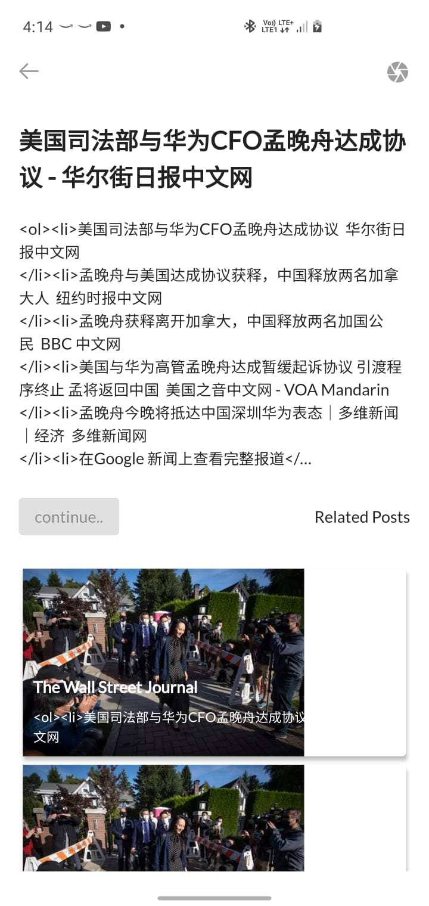

# Flutter News App using [Get Library](https://pub.dev/packages/get)

## Getting Started

It's easy for beginners, and accurate for experts

- Getx state manager is easier than using setState
- You just need to add a ".obs" at the end of your variable, and wrap the widget you want to change within a Obx()
- Wrap the widget you want to change within a Obx().

      void main() => runApp(MaterialApp(home: Home()));

      class Home extends StatelessWidget {
        var count = 0.obs;
        @override
        Widget build(context) => Scaffold(
            appBar: AppBar(title: Text("counter")),
            body: Center(
              child: Obx(() => Text("$count")),
            ),
            floatingActionButton: FloatingActionButton(
              child: Icon(Icons.add),
              onPressed: () => count ++,
            ));
      }

[OR]

- The most common way to do this is to separate the business logic from its visualization
- create a class by extending GetxController and insert ALL your variables and functions there

      class Controller extends GetxController {
        var count = 0;
        void increment() {
          count++;
          update();
        }
      }

call it like below, in your stateless widget

<b>Notice the use of Get.put(Controller()).</b> This is enough to make your controller available to other pages as long as it is in memory

    class Home extends StatelessWidget {
      final controller = Get.put(Controller());
      @override
      Widget build(BuildContext context) {
use it like below, wherever you want to use the result: ```

    GetBuilder<Controller>(
        builder: (_) => Text(
            'clicks: ${controller.count}',
        )),

```Get.to(Second())```, This is enough to navigate to another page. You don't need below code

    Navigator.of(context).push(context, 
    MaterialPageRoute(context, builder: (context){
        return Second();
    },);

for more; visite [website](https://pub.dev/packages/get)


### (App screenshots)

  


## Lets Flutter the Get

### why GetX is the best in my opinion

- Update only the required widgets.
- Does not use changeNotifier, it is the state manager that uses less memory (close to 0mb).
- Forget StatefulWidget! With Get you will never need it. With the other state managers, you will probably have to use a StatefulWidget to get the instance of your Provider, BLoC, MobX Controller, etc. But have you ever stopped to think that your appBar, your scaffold, and most of the widgets that are in your class are stateless? So why save the state of an entire class, if you can only save the state of the Widget that is stateful? Get solves that, too. Create a Stateless class, make everything stateless. If you need to update a single component, wrap it with GetBuilder, and its state will be maintained.
- Organize your project for real! Controllers must not be in your UI, place your TextEditController, or any controller you use within your Controller class.
- Do you need to trigger an event to update a widget as soon as it is rendered? GetBuilder has the property “initState”, just like StatefulWidget, and you can call events from your controller, directly from it, no more events being placed in your initState.
- Do you need to trigger an action like closing streams, timers and etc? GetBuilder also has the dispose property, where you can call events as soon as that widget is destroyed.
- Use streams only if necessary. You can use your StreamControllers inside your controller normally, and use StreamBuilder also normally, but remember, a stream reasonably consumes memory, reactive programming is beautiful, but you shouldn’t abuse it. 30 streams open simultaneously can be worse than changeNotifier (and changeNotifier is very bad).
